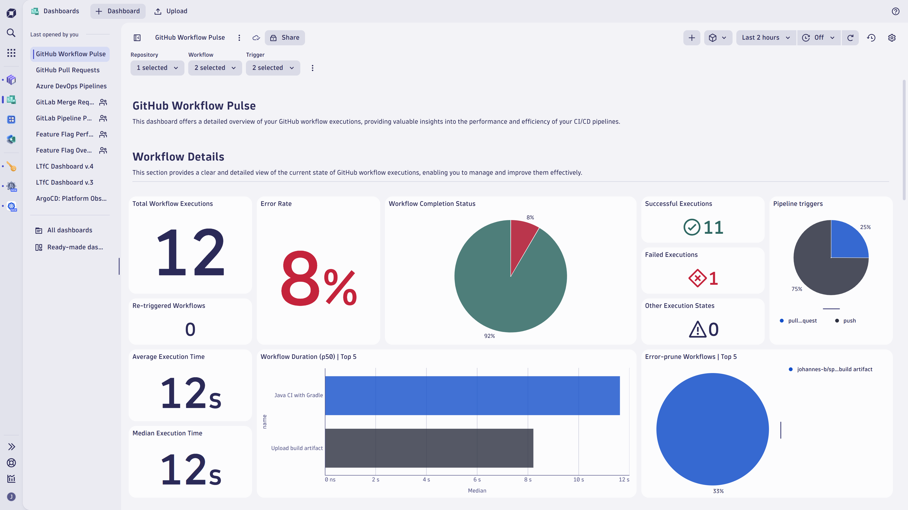
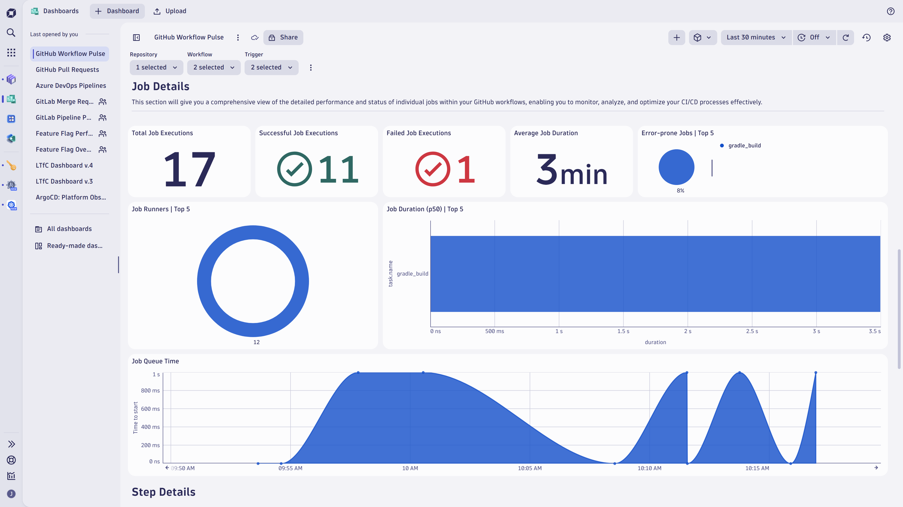
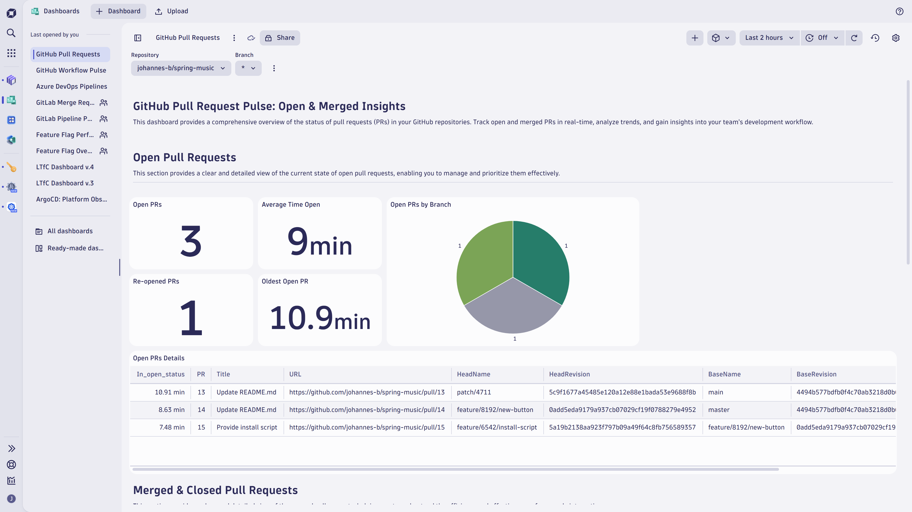

# Observe your GitHub actions (workflows) and pull requests with Dashboards and normalized SDLC events through OpenPipeline

Excited to dive into your GitHub workflow performance and uncover the secrets behind your pull request timings? For this use case, you'll

* Integrate GitHub and Dynatrace.
* Use Dashboards to observe GitHub workflows and pull requests.
* Use this information to make decisions about streamlining CI/CD workflows, improving productivity, and getting data-driven insights.

## Concepts

| Concept        | Description |
|------------|-----|
| Software Development Lifecycle (SDLC) events   | [SDLC events](https://docs.dynatrace.com/docs/deliver/pipeline-observability-sdlc-events/sdlc-events) are events with a separate event kind in Dynatrace that follow a well-defined semantic for capturing data points from a software component's software development lifecycle. The [SDLC event specification](https://docs.dynatrace.com/docs/discover-dynatrace/references/semantic-dictionary/model/sdlc-events) defines the semantics of those events. |
| Why were GitHub webhook events changed into SDLC events? | The main benefit is data normalization and becoming tool agnostic. As a result, Dynatrace Dashboards, Apps, and Workflows can build on SDLC events with well-defined properties rather than tool-specific details. |
| Why going with GitHub webhooks instead of REST API?  | Using webhooks has the following advantages over using the API: (1) Webhooks require less effort and less resources than polling an API. (2) Webhooks scale better than API calls. (3) Webhooks allow near real-time updates, since webhooks are triggered when an event happens. See [Choosing webhooks or the REST API](https://docs.github.com/en/webhooks/about-webhooks#choosing-webhooks-or-the-rest-api) for more details. |

## Target audience

This information is intended for platform engineers who use GitHub in their Internal Development Platform (IDP).

## What will you learn

In this tutorial, you'll learn how to

* Forward GitHub webhook events to Dynatrace.
* Normalize the ingested event data.
* Use Dashboards to analyze the data and derive improvements.

## Prerequisites

* [Install Dynatrace Configuration as Code via Monaco](https://docs.dynatrace.com/docs/deliver/configuration-as-code/monaco/installation)

## Setup

### Prepare the Monaco configuration

1. [Create an OAuth client](https://docs.dynatrace.com/docs/deliver/configuration-as-code/monaco/guides/create-oauth-client) with the following permissions.
    * Run apps: `app-engine:apps:run`
    * View OpenPipeline configurations: `openpipeline:configurations:read`
    * Edit OpenPipeline configurations: `openpipeline:configurations:write`
    * Create and edit documents: `document:documents:write`
    * View documents: `document:documents:read`

2. Store the retrieved client ID, secret, and token endpoint as separate environment variables.
    <!-- windows version -->
    Windows:
    ```
    $env:OAUTH_CLIENT_ID='<YOUR_CLIENT_ID>'
    $env:OAUTH_CLIENT_SECRET='<YOUR_CLIENT_SECRET>'
    $env:OAUTH_TOKEN_ENDPOINT='https://sso.dynatrace.com/sso/oauth2/token'
    ```
    <!-- linux / macOS version -->
    Linux / macOS:
    ```
    export OAUTH_CLIENT_ID='<YOUR_CLIENT_ID>'
    export OAUTH_CLIENT_SECRET='<YOUR_CLIENT_SECRET>'
    export OAUTH_TOKEN_ENDPOINT='https://sso.dynatrace.com/sso/oauth2/token'
    ```

3. Clone the [Dynatrace configuration as code sample](https://github.com/Dynatrace/dynatrace-configuration-as-code-samples) repository using the following commands and move to the `github_pipeline_observability` directory.
    ```
    git clone https://github.com/Dynatrace/dynatrace-configuration-as-code-samples.git
    cd dynatrace-configuration-as-code-samples/github_pipeline_observability
    ```

4. Edit the `manifest.yaml` by exchanging the `<YOUR-DT-ENV-ID>` placeholder with your Dynatrace environment ID at the name property and within the URL of the value property.
    ```
    manifestVersion: 1.0
    projects:
      - name: pipeline_observability
    environmentGroups:
      - name: group
        environments:
          - name: <YOUR-DT-ENV-ID>
            url:
              type: value
              value: https://<YOUR-DT-ENV-ID>.apps.dynatrace.com
            auth:
                oAuth:
                  clientId:
                    name: OAUTH_CLIENT_ID
                  clientSecret:
                    name: OAUTH_CLIENT_SECRET
                  tokenEndpoint:
                    type: environment
                    value: OAUTH_TOKEN_ENDPOINT
    ```

### Check the OpenPipeline configuration for SDLC events

> These steps modify the OpenPipeline configuration for SDLC events.
If your OpenPipeline configuration contains only default/built-in values, you can directly apply the Monaco configuration. If you have any custom ingest sources, dynamic routes, or pipelines, you'll first need to download your configuration and manually merge it into the Monaco configuration.

> Step 3 will indicate if a configuration merge is needed or if you can apply the provided configuration directly.

1. Go to **OpenPipeline** > **Events** > **Software development lifecycle**.
2.  Check the **Ingest sources**, **Dynamic routing**, and **Pipelines**.
    * Under **Ingest sources**, are there any other sources than **Endpoint for Software Development Lifecycle events**?
    * Under **Dynamic routing**, are there any other routes than **Default route**?
    * Under **Pipelines**, are there any other pipelines than **events.sdlc**?
3. If the answer to one of those questions is "yes", follow the steps below. Otherwise, skip ahead to step 4.
    * Download your OpenPipeline configuration
      ```
      monaco download -e <YOUR-DT-ENV-ID> --only-openpipeline
      ```
    * Open the following files:
      * Your downloaded configuration file, `download_<DATE>_<NUMBER>/project/openpipline/events.sdlc.json`.
      * The provided configuration file, `pipeline_observability/openpipline/events.sdlc.github.json`.
    * Merge the contents of events.sdlc.json into events.sdlc.github.json, and then save the file.
4. Apply the Monaco configuration.
  Run this command to apply the provided Monaco configuration.
  The configuration consists of (1) Dashboards to analyze GitHub activities and (2) OpenPipeline configuration to normalize [GitHub events](https://docs.github.com/en/webhooks/webhook-events-and-payloads) into [SDLC events](pipeline-observability-ingest-sdlc-events).
    ```
    monaco deploy manifest.yaml
    ```

### Create a Dynatrace access token

An access token with *openpipeline scopes* is needed for Dynatrace to receive GitHub webhook events processed by OpenPipeline. 

1. In Dynatrace, navigate to **Access Tokens**.
2. Click **Generate new token**.
3. Provide a descriptive name for your token.
4. Select the following scopes:
    * OpenPipeline - Ingest Software Development Lifecycle Events (Built-in)(`openpipeline.events_sdlc.custom`)
    * OpenPipeline - Ingest Software Development Lifecycle Events (Custom)(`openpipeline.events_sdlc`)
5. Click **Generate token**
6. Save the generated token securely for subsequent steps. It will be referred as `<YOUR-ACCESS-TOKEN>`.
​
### Create the GitHub webhook 

Currently, sending GitHub webhook events to Dynatrace necessitates an additional step because Dynatrace does not support HMAC-SHA256 signature verification, and GitHub does not offer custom headers for request authentication. Therefore, setting up a proxy, such as a serverless function, is required as an interim solution.

<details>

<summary>**Proxy the GitHub Dynatrace connection**</summary>

Proxying the GitHub webhook event through an AWS Lambda function to check the signature and to append the authentication header before forwarding it to Dynatrace.

* Retrieve secrets and access token from secrets manager
* Extract the signature from the headers
* Verify the signature
* Forward the webhook event with an authentication header
* Use the public URL of the Lambda when configuring the **Paylod URL** in GitHub Webhooks settings below.

    <details>

    <summary>*Example of an AWS Lambda function in Python*</summary>

    * Store a shared secret and `<YOUR-ACCESS-TOKEN>` in AWS Secrets Manager.
    * Exchange the placeholders `<YOUR-DT-ENV-ID>` with your Dynatrace environment ID in the below function code.

    ```python
    import json
    import hmac
    import hashlib
    import requests
    import boto3

    def lambda_handler(event, context):
        # Initialize the Secrets Manager client
        client = boto3.client('secretsmanager')
        
        # Retrieve secrets from AWS Secrets Manager
        secret_name = 'your_secret_name'
        secret_response = client.get_secret_value(SecretId=secret_name)
        secrets = json.loads(secret_response['SecretString'])
        
        # Extract the GitHub webhook secret and authentication token
        github_secret = secrets['github_secret']
        api_token = secrets['api_token']
        
        # Endpoint to forward the webhook event
        forward_url = 'https://<YOUR-DT-ENV-ID>.live.dynatrace.com/platform/ingest/custom/events.sdlc/github'
        
        # Extract the signature from the headers
        signature = event['headers'].get('X-Hub-Signature-256')
        
        if not signature:
            return {
                'statusCode': 400,
                'body': json.dumps({'message': 'Signature missing'})
            }
        
        # Compute the HMAC SHA256 hash
        computed_signature = 'sha256=' + hmac.new(github_secret.encode(), event['body'].encode(), hashlib.sha256).hexdigest()
        
        # Verify the signature
        if not hmac.compare_digest(computed_signature, signature):
            return {
                'statusCode': 403,
                'body': json.dumps({'message': 'Invalid signature'})
            }
        
        # Forward the webhook event with an authentication header
        headers = {
            'Content-Type': 'application/json',
            'Authorization': f'Api-Token {api_token}'
        }
        response = requests.post(forward_url, headers=headers, data=event['body'])
        
        return {
            'statusCode': response.status_code,
            'body': response.text
        }
    ```
    </details>

</details>

<details>

<summary>Insecure: Token in query parameter</summary>

> **Security Disclaimer**: Use this approach only in a sandbox environment, not in production. :exclamation: This step involves the use of a Dynatrace access token in GitHub webhook configuration, which could be misused if accessed by unauthorized individuals. To mitigate this risk, please adhere to the following security best practices:
> * **Minimal Permissions**: Assign the least set of permissions necessary for the access token, as outlined in this tutorial.
> * **Access Control**: Limit the ability to configure webhooks in GitHub to a small group of authorized personnel.
> * **Token Security**: Never commit the access token to a Git repository.

* Exchange the placeholders `<YOUR-DT-ENV-ID>` and `<YOUR-ACCESS-TOKEN>` with your Dynatrace environment ID and access token, respectively. 
```
https://<YOUR-DT-ENV-ID>.live.dynatrace.com/platform/ingest/custom/events.sdlc/github?api-token=<YOUR-ACCESS-TOKEN>
```
* Use this URL when configuring the **Paylod URL** in GitHub Webhooks settings below.

</details>

1. In GitHub, select your organization or repository.
2. Go to **Settings** > **Webhooks**.
3. Click **Add webhook**.
4. Configure the following settings:
   - **Payload URL**: Enter the URL that receives the webhook event.
   - **Content Type**: `application/json`
   - **Secret**: Enter a shared secret used for signature verification.
   - **Which events would you like to trigger this webhook?**: Select *Let me select individual events* and enable:
     - Pull requests
     - Workflow runs
     - Workflow jobs
     - (disable "Pushes")
5. Select **Active** to receive event details when the hook is triggered.
6. Click **Add webhook** to save the webhook.

## Work with GitHub and observe organization-wide activities in Dashboards

Now that you've successfully configured GitHub and Dynatrace, you can use Dashboards and [SDLC events](https://docs.dynatrace.com/docs/deliver/pipeline-observability-sdlc-events/sdlc-events) to observe your GitHub workflows and pull requests.

Open the **GitHub Workflow Pulse** and the **GitHub Pull Requests** dashboards to observe and analyze:

* Real-time activities of all pull requests in your organization or selected GitHub repositories.
* Workflow execution details
* Job insights
* Step durations for workflows in your organization or selected GitHub repositories.

| Workflow details: | Job insights: | Pull request insights: |
|------------|-----|-------------|
|    |  |  |

Leverage those insights for the following improvement areas of your internal development platform (IDP):

* Streamline CI/CD pipeline

  Observing pipeline executions lets you identify bottlenecks and inefficiencies in your CI/CD pipelines.
  Knowing about these bottlenecks and inefficiencies helps optimize build and deployment processes, leading to faster and more reliable releases.

* Improve developer productivity

  Automated pipelines reduce the manual effort required for repetitive tasks, such as running tests and checking coding standards.
  This automation allows developers to focus more on writing code and less on administrative tasks.

* Get data-driven job insights

  Analyzing telemetry data from pull requests and pipelines provides valuable insights into the development process.
  You can use the telemetry data to make informed decisions and continuously improve the development flows.

## Call to action

We highly value your insights on GitHub workflow observability. Your feedback is crucial in helping us enhance our tools and services. Visit the Dynatrace Community page to share your experiences, suggestions, and ideas directly on [Feedback channel for CI/CD Pipeline Observability](https://community.dynatrace.com/t5/Platform-Engineering/Feedback-channel-for-CI-CD-Pipeline-Observability/m-p/269193). 

## Further reading

**Pipeline Observability**

* [Observability throughout the software development lifecycle increases delivery performance](https://www.dynatrace.com/news/blog/observability-throughout-the-software-development-lifecycle/) (blog post)
* [Concepts](https://docs.dynatrace.com/docs/deliver/pipeline-observability-sdlc-events/pipeline-observability-concepts) (docs)

**Software Development Lifecycle Events**

* [Ingest SDLC events](https://docs.dynatrace.com/docs/deliver/pipeline-observability-sdlc-events/sdlc-events) (docs)
* [SDLC event specification](https://docs.dynatrace.com/docs/discover-dynatrace/references/semantic-dictionary/model/sdlc-events) (docs)