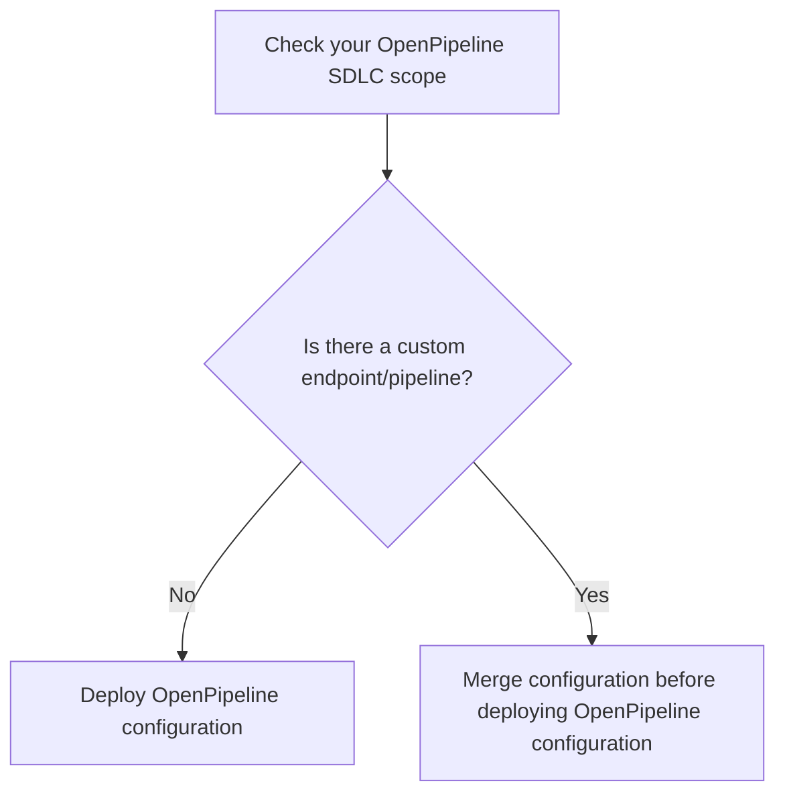

# GitHub Pipeline Observability Package

If you want to know how your GitHub workflows are performing in terms of task duration, failure rate, runner utilization, etc. and you are interested in analyzing pull requests, then leverage this **GitHub Pipeline Observability Package**. To apply it, two steps are required:
* Configure Dynatrace OpenPipeline and upload Dashboards
* Configure GitHub to send Webhook events to Dynatrace

## Configure Dynatrace OpenPipeline and upload Dashboards

### Prerequisites

1. [Install Dynatrace Configuration as Code via Monaco](https://docs.dynatrace.com/docs/deliver/configuration-as-code/monaco/installation)

2. [Create an API token](https://docs.dynatrace.com/docs/deliver/configuration-as-code/monaco/manage-configuration#prerequisites) and store it as an environment variable:
```
$env:DT_ENV_TOKEN 
```

3. [Create an OAuth client](https://docs.dynatrace.com/docs/deliver/configuration-as-code/monaco/guides/create-oauth-client) with the following permissions and store it as an environment variables:
    * "Scopes"
```
$env:OAUTH_CLIENT_ID
$env:OAUTH_CLIENT_SECRET 
```

4. Download this repository and go to `github_pipeline_observability`
```
git clone https://github.com/Dynatrace/dynatrace-configuration-as-code-samples.git
cd github_pipeline_observability
```

5. Edit the `manifest.yaml` to configure your environment:
```
manifestVersion: 1.0
projects:
  - name: pipeline_observability
environmentGroups:
  - name: group
    environments:
      - name: <ENVIRONMENT-NAME>
        url:
          type: value
          value: <YOUR-DT-ENV>
        auth:
            token:
              name: DT_ENV_TOKEN
            oAuth:
              clientId:
                name: OAUTH_CLIENT_ID
              clientSecret:
                name: OAUTH_CLIENT_SECRET
              tokenEndpoint:
                type: environment
                value: OAUTH_TOKEN_ENDPOINT
```

### Apply Monaco configuration


```mermaid
flowchart TD
  A[Check your OpenPipeline SDLC scope] --> B{Is there a custom endpoint/pipeline?};
  B -- No --> C[Deploy OpenPipeline configuration]
  B -- Yes --> D[Merge configuration before deploying OpenPipeline configuration]
```


#### Deploy OpenPipeline configuratioon

To prepare Dynatrace for GitHub pipeline observability, a OpenPipeline and two Dashboards need to be configured. 
Run the following command to apply this configure. 

```
monaco deploy manifest.yaml
```

#### Merge configuration before deploying OpenPipeline configuration

MERGE is needed

## Configure GitHub to send Webhook events to Dynatrace

#### Create Dynatrace Access Token

To allow Dynatrace receiving GitHub webhook events that are processed using OpenPipeline, an access token with *openpipeline scopes* is needed. 

1. In Dynatrace, navigate to **Access Tokens**.
2. Click **Generate new token**.
3. Provide a descriptive name for your token.
4. Select the following scopes:
   - `openpipeline.events_sdlc.custom` 
   - `openpipeline.events_sdlc`
5. Click **Generate token**
6. Save the generated token securely for subsequent steps. It will be referred as `YOUR-ACCESS-TOKEN`.
​
#### Configure GitHub Webhook

You can configure webhooks at either the organization level (affecting all repositories) or the repository level. Note that *Lead Time For Changes* calculations and monitoring will only include the repositories where webhooks are configured.

1. In GitHub, select your organization or repository.
2. Go to **Settings** > **Webhooks**.
3. Click **Add webhook**.
4. Configure the following settings:
   - **Payload URL**: 
     ```
     https://{your-environment-id}.live.dynatrace.com/platform/ingest/custom/events.sdlc/github?api-token={YOUR-ACCESS-TOKEN}
     ```
   - **Content Type**: `application/json`
   - **Which events would you like to trigger this webhook?**: Select *Let me select individual events* and enable:
     - Pull requests
     - Statuses
     - Workflow runs
     - Workflow jobs
     - (disable "Pushes")
5. Select **Active** to receive event details when the hook is triggered.
6. Click **Add webhook** to save the webhook.

## Observe your GitHub workfow and pull request activities

#### GitHub Workflow monitoring
* Overall Pipeline analysis
    * Total number of pipeline runs (+details)
    * Pipeline duration: p50, avg
    * Failure rate / Pipeline completion status
    * Re-runs
    * Pipeline triggers
    * Error-prune pipelines | Top 5

* Pipeline tasks / steps
    * Task duration (p50)
    * Error-prune tasks | Top 5
    * Distribution of Runners
    * Steps by duration (p50) | Top 5


#### GitHub Pull Request monitoring
* Open PRs (+details)
* Open PRs by repository
* In Open status
* Merged PRs (+details)
* Merged PRs by taget repository
* Time to merge (Open-to-merge duration): p50, avg
