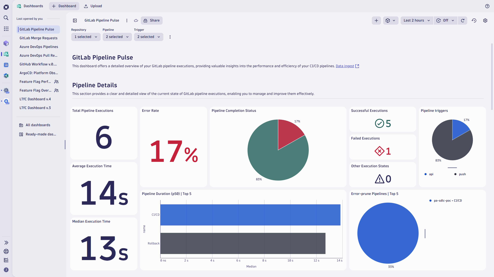
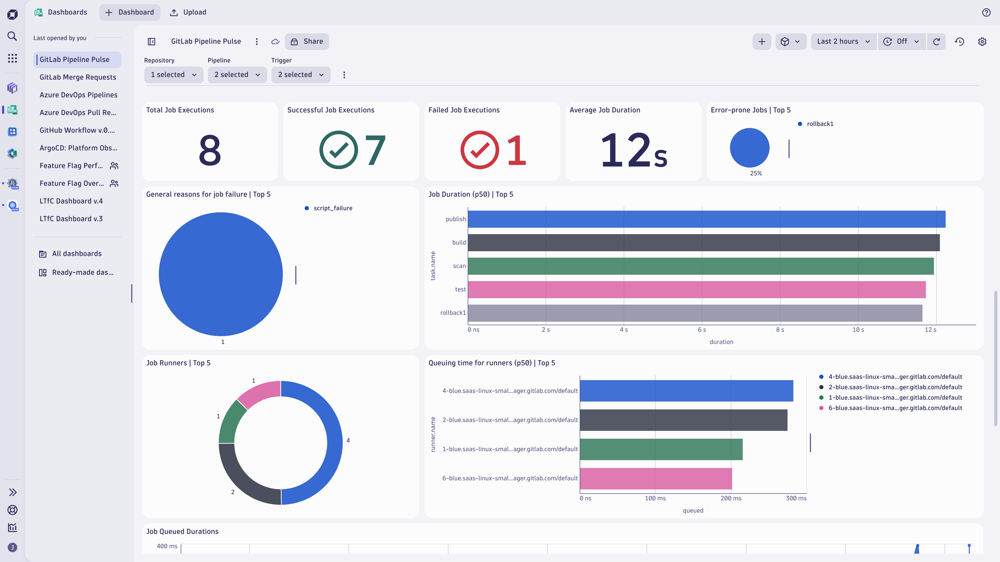
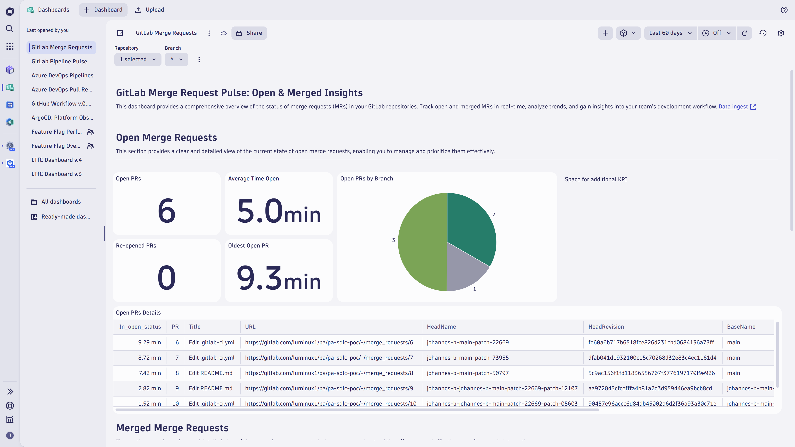

# Observe your GitLab pipelines and merge requests with Dashboards and normalized SDLC events through OpenPipeline

Excited to dive into your GitLab pipeline performance and uncover the secrets behind your merge request timings? For this use case, you'll

* Integrate GitLab and Dynatrace.
* Use Dashboards to observe GitLab pipelines and merge requests.
* Use this information to make decisions about streamlining CI/CD pipelines, improving productivity, and getting data-driven insights.

## Concepts


| Concept                                                  | Description                                                                                                                                                                                                                                                                                                                                                                                                                                                   |
|----------------------------------------------------------|---------------------------------------------------------------------------------------------------------------------------------------------------------------------------------------------------------------------------------------------------------------------------------------------------------------------------------------------------------------------------------------------------------------------------------------------------------------|
| Software Development Lifecycle (SDLC) events             | [SDLC events](https://docs.dynatrace.com/docs/deliver/pipeline-observability-sdlc-events/sdlc-events) are events with a separate event kind in Dynatrace that follow a well-defined semantic for capturing data points from a software component's software development lifecycle. The [SDLC event specification](https://docs.dynatrace.com/docs/discover-dynatrace/references/semantic-dictionary/model/sdlc-events) defines the semantics of those events. |
| Why were GitLab webhook events changed into SDLC events? | The main benefit is data normalization and becoming tool agnostic. As a result, Dynatrace Dashboards, Apps, and Workflows can build on SDLC events with well-defined properties rather than tool-specific details.                                                                                                                                                                                                                                            |
| Why going with GitLab webhooks instead of REST API?      | Using webhooks has the following advantages over using the API: (1) Webhooks require less effort and less resources than polling an API. (2) Webhooks scale better than API calls. (3) Webhooks allow near real-time updates, since webhooks are triggered when an event happens. See [Choosing webhooks or the REST API](https://docs.github.com/en/webhooks/about-webhooks#choosing-webhooks-or-the-rest-api) for more details.                             |

## Target audience

This information is intended for platform engineers who use GitLab in their Internal Development Platform (IDP).

## What will you learn

In this tutorial, you'll learn how to

* Forward GitLab webhook events to Dynatrace.
* Normalize the ingested event data.
* Use Dashboards to analyze the data and derive improvements.

## Prerequisites

* [Install Dynatrace Configuration as Code via Monaco](https://docs.dynatrace.com/docs/deliver/configuration-as-code/monaco/installation)

## Setup

### Prepare the Monaco configuration.

1. [Create a Platform token](https://docs.dynatrace.com/docs/deliver/configuration-as-code/monaco/guides/create-platform-token) with the following permissions.
    * Run apps: `app-engine:apps:run`
    * View OpenPipeline configurations: `settings:objects:read`
    * Edit OpenPipeline configurations: `settings:objects:write`
    * Create and edit documents: `document:documents:write`
    * View documents: `document:documents:read`

2. Store the retrieved platform token in an environment variable.
    <!-- windows version -->
   Windows:
    ```
    $env:DT_PLATFORM_TOKEN='<YOUR_PLATFORM_TOKEN>'
    ```
    <!-- linux / macOS version -->
   Linux / macOS:
    ```
    export DT_PLATFORM_TOKEN='<YOUR_PLATFORM_TOKEN>'
    ```

3. Clone the [Dynatrace configuration as code sample](https://github.com/Dynatrace/dynatrace-configuration-as-code-samples) repository using the following commands and move to the `gitlab_pipeline_observability` directory.
    ```
    git clone https://github.com/Dynatrace/dynatrace-configuration-as-code-samples.git
    cd dynatrace-configuration-as-code-samples/gitlab_pipeline_observability
    ```

4. Edit the `manifest.yaml` by exchanging the `<YOUR-DT-ENV-ID>` placeholder with your Dynatrace environment ID at the name property and within the URL of the value property.
    ```
    manifestVersion: 1.0
    projects:
      - name: pipeline_observability
    environmentGroups:
      - name: group
        environments:
          - name: <YOUR-DT-ENV-ID>
            url:
              type: value
              value: https://<YOUR-DT-ENV-ID>.apps.dynatrace.com
            auth:
              platformToken:
                name: DT_PLATFORM_TOKEN
    ```

### Check the OpenPipeline configuration for SDLC events

> These steps modify the OpenPipeline configuration for SDLC events.
If your OpenPipeline configuration contains only default/built-in values, you can directly apply the Monaco configuration. If you have any dynamic routes, you'll first need to download your configuration and manually merge it into the Monaco configuration.

> Step 3 will indicate if a configuration merge is needed or if you can apply the provided configuration directly.

1. Go to **Settings** > **Process and contextualize** > **OpenPipeline** > **Software Development Lifecycle**.
2.  Check the **Dynamic routing** section, are there any other routes than **Default route**?
3. If the answer is "yes", follow the steps below. Otherwise, skip ahead to step 4.
    * Download your OpenPipeline configuration
      ```
      monaco download -e <YOUR-DT-ENV-ID> --settings-schema "builtin:openpipeline.events.sdlc.routing"
      ```
    * Open the following files:
        * Your downloaded configuration file, `download_<DATE>-<TIME>/project_<YOUR-DT-ENV-ID>/builtinopenpipeline.events.sdlc.routing/<SOME-UUID>.json`.
        * The provided configuration file, `pipeline_observability/openpipeline/events.sdlc.global.routing.json`.
    * Merge the `routingEntries` of your downloaded routing file into the `routingEntries` of `events.sdlc.global.routing.json`, and then save the file.
      This is mandatory as the **Dynamic Routing table** is a global configuration and the order of the entries as well as the `matcher` clauses determine the overall routing.
4. Apply the Monaco configuration.
   Run this command to apply the provided Monaco configuration.
   The configuration consists of (1) Dashboards to analyze GitLab activities and (2) OpenPipeline configuration to normalize [GitLab events](https://docs.gitlab.com/user/project/integrations/webhook_events/) into [SDLC events](https://docs.dynatrace.com/docs/deliver/pipeline-observability-sdlc-events/sdlc-events).
    ```
    monaco deploy manifest.yaml
    ```

### Create a Dynatrace access token

An access token with *openpipeline scopes* is needed for Dynatrace to receive GitLab webhook events processed by OpenPipeline.

1. In Dynatrace, navigate to **Access Tokens**.
2. Click **Generate new token**.
3. Provide a descriptive name for your token.
4. Select the following scopes:
    * OpenPipeline - Ingest Software Development Lifecycle Events (Built-in)(`openpipeline.events_sdlc`)
    * OpenPipeline - Ingest Software Development Lifecycle Events (Custom)(`openpipeline.events_sdlc.custom`)
5. Click **Generate token**
6. Save the generated token securely for subsequent steps. It will be referred as `<YOUR-ACCESS-TOKEN>`.

### Create the GitLab webhook

1. [Create the GitLab webhook](https://dt-url.net/yt23w6x) with the following settings
    * **URL**: enter your placeholders for your Dynatrace environment ID `<YOUR-DT-ENV-ID>` and access token `<YOUR-ACCESS-TOKEN>`.
      ```
      https://<YOUR-DT-ENV-ID>.live.dynatrace.com/platform/ingest/custom/events.sdlc/gitlab
      ```
    * You can enter an optional webhook name and description, but skip the **Secret token** setting since a custom header manages request validation.
    * In the **Trigger** section, select the following events to trigger the webhook.
        * **Merge request events**
        * **Job events**
        * **Pipeline events**
        * **Deployment events**
        * **Releases events**

2. [Add custom header](https://dt-url.net/5203zv5) to your webhook with the name `Authorization` and value `Api-Token <YOUR-ACCESS-TOKEN>`.

## Unlock enhanced development insights with GitLab Dashboards

Now that you've successfully configured GitLab and Dynatrace, you can use Dashboards and SDLC events to observe your GitLab pipelines and merge requests within the entire development organization.

### Analyze

In Dynatrace, open the **GitLab Pipeline Pulse** and **GitLab Merge Request** dashboards to:

* Track real-time activities of merge requests.
* Analyze CI/CD pipeline execution details and pipeline health.
* Gain job insights.
* Review step durations for pipelines.
* Analyze deployment and release activities

| Pipeline details:                                        | Job insights:                                       | Merge request insights:                      |
|----------------------------------------------------------|-----------------------------------------------------|----------------------------------------------|
|  |  |  |

### Optimize

Leverage those insights for the following improvement areas:

* **Streamline CI/CD pipeline**: Observing pipeline executions lets you identify bottlenecks and inefficiencies in your CI/CD pipelines.
  Knowing about these bottlenecks and inefficiencies helps optimize build and deployment processes, leading to faster and more reliable releases.

* **Improve developer productivity**: Automated pipelines reduce the manual effort required for repetitive tasks, such as running tests and checking coding standards.
  This automation allows developers to focus more on writing code and less on administrative tasks.

* **Get data-driven development insights**: Analyzing telemetry data from merge requests and pipelines provides valuable insights into the development process.
  You can use the telemetry data to make informed decisions and continuously improve the development flows.

### Continuous improvements

Regularly review and tweak your CI/CD pipelines to ensure they are optimized for performance.

In Dynatrace, adjust the timeframe of the **GitLab Pipeline Pulse** and **GitLab Merge Request** dashboards to monitor the long-term impact of your improvements.

## Call to action

We highly value your insights on GitLab pipeline observability. Your feedback is crucial in helping us enhance our tools and services. Visit the Dynatrace Community page to share your experiences, suggestions, and ideas directly on [Feedback channel for CI/CD Pipeline Observability](https://community.dynatrace.com/t5/Platform-Engineering/Feedback-channel-for-CI-CD-Pipeline-Observability/m-p/269193).

## Further reading

**Pipeline Observability**

* [Observability throughout the software development lifecycle increases delivery performance](https://www.dynatrace.com/news/blog/observability-throughout-the-software-development-lifecycle/) (blog post)
* [Concepts](https://docs.dynatrace.com/docs/deliver/pipeline-observability-sdlc-events/pipeline-observability-concepts) (docs)

**Software Development Lifecycle Events**

* [Ingest SDLC events](https://docs.dynatrace.com/docs/deliver/pipeline-observability-sdlc-events/sdlc-events) (docs)
* [SDLC event specification](https://docs.dynatrace.com/docs/discover-dynatrace/references/semantic-dictionary/model/sdlc-events) (docs)