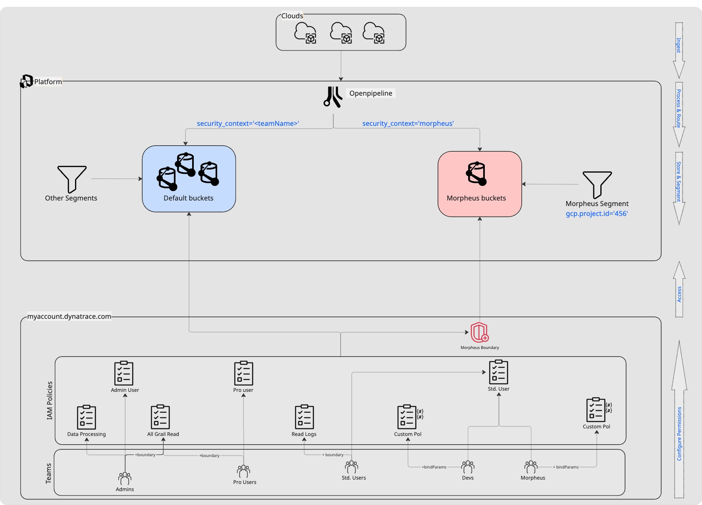

# Dynatrace IAM Terraform Sample

## Introduction

This repository demonstrates best practices for managing Dynatrace IAM (Identity and Access Management) using Terraform. The goal is to provide a practical, modular, and scalable approach to IAM policy management, leveraging both default policies with policy boundaries, as well as custom policies with policy templating. This enables organizations to implement fine-grained access control for classic observability teams (such as Central Admin, Observability, Engineering. etc.) as well as for specialized teams working on particular projects.

## Why This Repository?

Modern enterprise environments require robust and flexible access control. Dynatrace IAM provides powerful access control primitives, but applying them consistently and securely across teams can be challenging. This repository showcases:

- **Best practices for Dynatrace IAM access control** using Terraform.
- **Default policies with custom policy boundaries** for classic observability teams, ensuring least-privilege access and compliance.
- **Custom policies with policy parameters** for specialized teams, enabling dynamic and context-aware permissions.
- **Separation of configuration and code** for easier maintenance and scalability.
- **Examples and patterns** that can be adapted to your own organization.


### IAM best practices highlighted

- Use `default policies` whenever possible and implement your specific access requirements in `policy boundaries`
- Consider creating `custom policies` if `default policies` deviate significantly from your use cases or if you prefer to have more control on how you tailor and when you update access permissions
  - On special cases, it may make sense to consider `policy templating` by using bind parameters within your custom policies.
- Combine access requirements with your tagging strategy, data processing and filtering.


## Getting Started

To get this project running on your system:

1. **Clone the repository**
2. **Install Terraform** ([Install Guide](https://developer.hashicorp.com/terraform/install))
3. **Generate OAuth client** ([Account Management](https://myaccount.dynatrace.com))
   - To support all resource creation here, esure you include the following scopes:
  
`account-env-read`, `iam:groups:read`, `account-idm-read`, `account-idm-write`, `iam-policies-management`, `storage:filter-segments:admin`, `storage:bucket-definitions:read`, `storage:bucket-definitions:write`, `storage:bucket-definitions:delete`, `openpipeline:configurations:read`, `openpipeline:configurations:write`, `storage:filter-segments:read`, `storage:filter-segments:write`, `storage:filter-segments:delete`, `storage:filter-segments:admin`

4. **Set required environment variables:**
    ```sh
    export DYNATRACE_ENV_URL=<your_env_url>
    export DT_CLIENT_ID=<your_client_id>
    export DT_CLIENT_SECRET=<your_client_secret>
    export TF_VAR_DT_ACCOUNT_ID=<your_account_id>
    ```
5. **Enter your environment IDs in ./config/config.yaml:**
   Speficy at least one environment ID the config.yaml file

6. **Optionally modify ./config/config.yaml:**
   You might want to modify the config file that drives the Terraform code by adding additional buckets, segments, pipelines, teams, or modify permission assignments to better match your access scenario

7. **Optionally modify the location of the Terraform statefile:**
   You can do so by changing the `backend` section of the providers.tf file. It is advisable for production environments to store this Terraform state file in secure cloud location rather than on the local machine.

8. **Initialize Terraform:**
    ```sh
    terraform init
    ```
9. **Review the plan:**
    ```sh
    terraform plan
    ``
10. **Apply the configuration:**
    ```sh
    terraform apply
    ```

## Project Structure

- `main.tf` – Terraform code for creating the Dynatrace resources as defined in the config.yaml file
- `locals.tf` – Local variables to transform config.yaml for easier procesing in code.
- `.\config\config.yaml` – Declarative configuration for all resources.
- `.\config\policy_statements\*.*` – Policy & boundary statements referenced in config.yaml
- `.\config\segments\*.*` – Segment json definitions referenced in config.yaml
- `README.md` – Project documentation.

## Example: Access Permissions by Team

This repository includes example mappings for access control across some sample enterprise teams. Three central teams are granted permissions leveraging Dynatrace-managed `default policies` at platform and data categories along with `policy boundaries`. Two other teams make use of `custom policies` and `policy templating`.

| :soccer: Team             | :page_with_curl: Platform Access  | :page_with_curl: Data Access                                                                                                                                              |:left_right_arrow: Segment                 | :customs: Access Restrictions                                                                         |
|---------------------------|-----------------------------------|---------------------------------------------------------------------------------------------------------------------------------------------------------------------------|-------------------------------------------|-------------------------------------------------------------------------------------------------------|
| **Central Admins**        | `Admin User`                      | `Data Processing and Storage`<br>`All Grail data read access`                                                                                                             |                                           | - No access to `morpheus` bucket ([Boundary](./config/policy_statements/bnd_demo_morpheus_block.bnd)) |
| **Central Observability** | `Pro User`                        | `All Grail data read access`                                                                                                                                              |                                           | - No access to `morpheus` bucket ([Boundary](./config/policy_statements/bnd_demo_morpheus_block.bnd)) |
| **Central Engineering**   | `Pro User`                        | `Read Logs`                                                                                                                                                               |                                           | - No access to `morpheus` bucket ([Boundary](./config/policy_statements/bnd_demo_morpheus_block.bnd)) |
| **Mobile Developers**     | `Standard User`                   | :pencil2: `Custom policy` with templating :hash:- `project_id` + `storage:dt.security_context` ([Policy](./config/policy_statements/pol_demo_project_mobile_team.pol))    |                                           | - No access to `morpheus` bucket ([Boundary](./config/policy_statements/bnd_demo_morpheus_block.bnd)) |
| **Project Morpheus**      | `Standard User`                   | :pencil2: `Custom policy` with templating :hash:- `project_id` + `storage:dt.security_context` ([Policy](./config/policy_statements/pol_demo_project_morpheus_team.pol))  |`dt.system_bucket = "demo_morpheus_bucket"` ([Segment](./config/segments/morpheus.json))|                                                          |

To complement the permission assignment, this sample repo also includes creation of Grail buckets, Openpipelines and Segments. The diagram below depicts what this repo covers.




## Contributing

Contributions are welcome! Please open issues or submit pull requests to help improve this repository. Suggestions for new patterns, bug fixes, or documentation improvements are appreciated.

## References
- [Dynatrace IAM Documentation](https://docs.dynatrace.com/docs/manage/access-control/iam/introduction)
- [IAM Default Policies](https://docs.dynatrace.com/docs/manage/identity-access-management/use-cases/default-groups-permissions)
- [IAM Policy Boundaries](https://docs.dynatrace.com/docs/manage/identity-access-management/permission-management/manage-user-permissions-policies/iam-policy-boundaries)
- [IAM Policy Templating](https://docs.dynatrace.com/docs/manage/identity-access-management/permission-management/manage-user-permissions-policies/advanced/iam-policy-templating)
- [Terraform Install Guide](https://developer.hashicorp.com/terraform/install)
- [Dynatrace Terraform Provider](https://registry.terraform.io/providers/dynatrace-oss/dynatrace/latest/docs)

---
This repository is maintained to help teams adopt secure, scalable, and maintainable IAM practices in Dynatrace using Terraform.