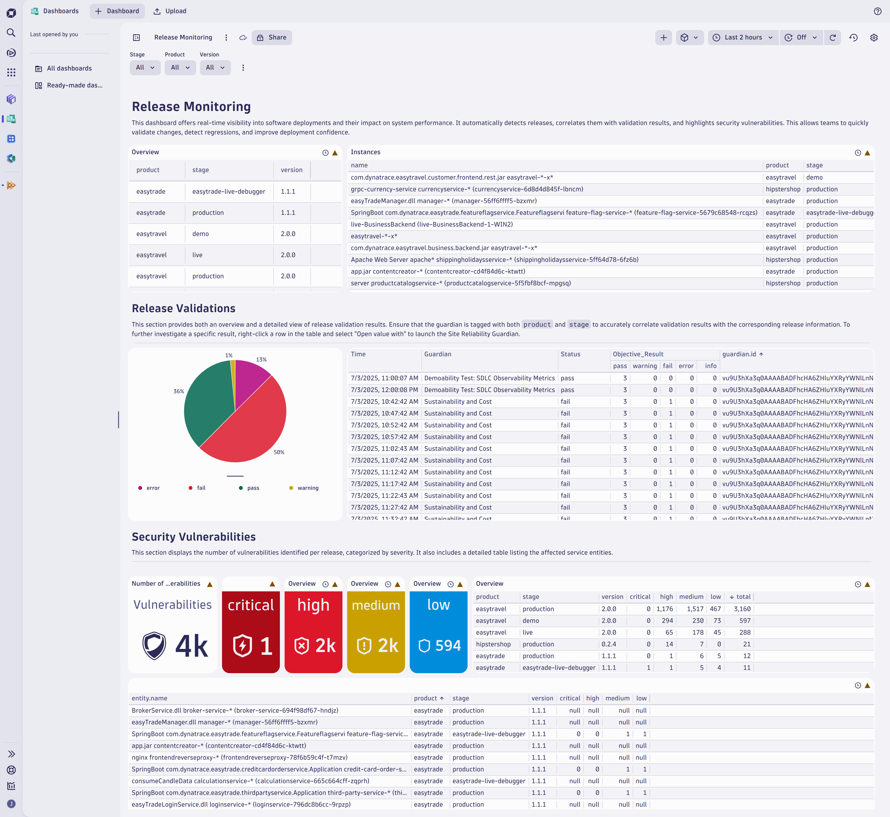
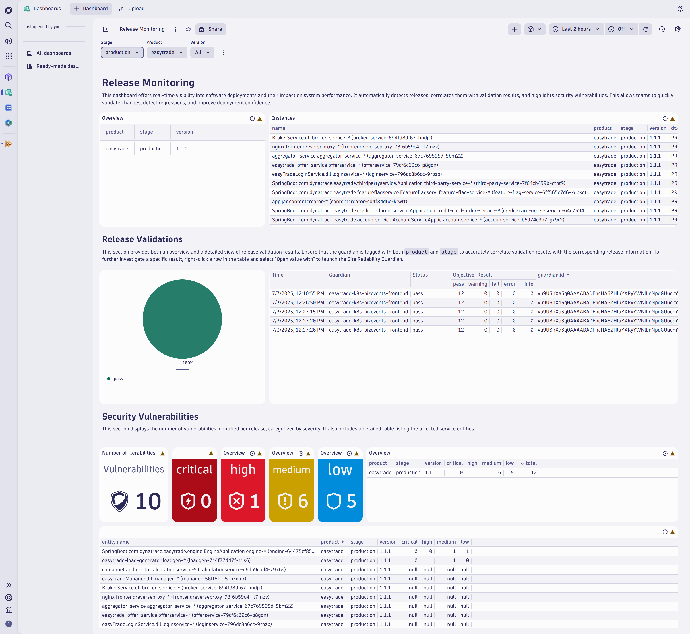

# Release Monitoring

This package provides a preconfigured Dynatrace dashboard designed to monitor and analyze software releases across your environments. The dashboards offer both high-level overviews and detailed insights into release activity, validation results, and associated risks such as vulnerabilities. To enable accurate release detection and ensure the dashboards function as intended, please refer to the Dynatrace [version detection strategies](https://docs.dynatrace.com/docs/deliver/release-monitoring/version-detection-strategies) documentation and ensure all required prerequisites are met.

# Dashboards preview

| Overview | Filtered |
|------------|-----|
|    |  |

