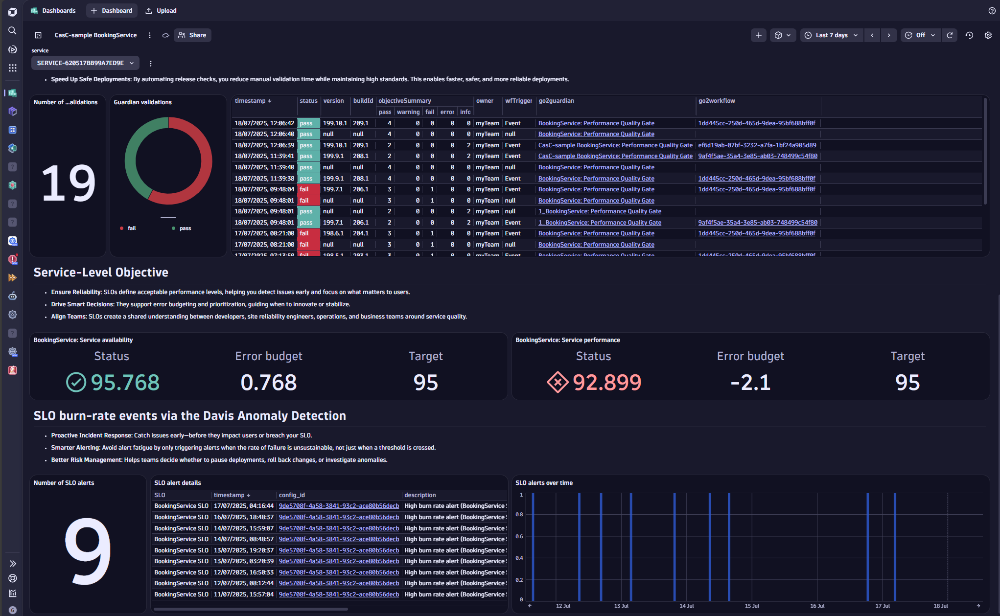

# Service Monitoring and Validation Sample

This package provides a preconfigured Dynatrace dashboard for monitoring and validating the health and performance of a selected service.
It contains sections for the 4 golden signals, release validation results, service-level objectives, and SLO fast-error budget burn rate alerts.
Additionally, it provides a simple alert-notification workflow to send an email in case of a high error budget burn rate alert.
The sample demonstrates an option of using Dynatrace resources together to monitor single key metrics, (automated) Site Reliability Guardian release validations, continuous performance evaluation via SLOs, and alert notifications in case an SLO is at risk.

## Features

- **Comprehensive service status overview:** Visualizes the current service health via its key metrics (4 golden signals), results of historic release validations, continuous evaluation of performance and availability SLOs, and past alerts indicating a too-high error budget consumption.
- **References for further analysis:** Links to the underlying automation, such as automated release validation and alert notifications, are given.

## Included Dynatrace resources
- **Dashboard** provides an overview of the selected service's health and performance status, including release validations, SLOs, and past burn rate alerts.
- **Site Reliability Guardian** validating the 4 golden signals.
- **Release validation workflow** to automate the Site Reliability Guardian validations.
- **Service-level objectives** to continuously observe the availability and performance of the selected service.
- **Davis® AI anomaly detector** to continuously monitor the SLO's burn rate and raise an alert if the error budget consumption is too high.
- **Alert notification workflow** to automatically send an email in case an SLO error budget burn rate alert is raised.

## Prerequisites

To ensure the Dynatrace configurations work as intended:

- Monaco version `v2.24.0+`
- Platform token ([See our documentation](https://docs.dynatrace.com/docs/shortlink/configuration-as-code-create-platform-token)) covering the needed permission: Documents, Automation, SLO v2, Settings, email, and additionally `app-engine:apps:run`

## Dashboard Previews

| Overview |
|----------|
|  |

## Getting Started

1. **Clone or Download** this repository.
2. In **`service_monitoring_sample\config.yaml`**, configure an email address by replacing "myteam@mycompany.com" with your email address, set proper names, tags and event filter parameter as indicated by "#INPUT" comments in the file.
3. **Set your environment variables**: You need a Dynatrace Platform environment and the following environment variables to try this out:
* `DT_ENV_URL`: https://YOUR-DT-ENVIRONMENT-ID.apps.dynatrace.com
* `PLATFORM_TOKEN`: *Returned when creating the platform token* (see:[docs](https://docs.dynatrace.com/docs/shortlink/configuration-as-code-create-platform-token))
* `SERVICE_ID`: Add the Dynatrace service entity ID that shall be used in the sample, in the format: "SERVICE-XYXYXYXYXYXYXYXY"
4. **Deploy Dynatrace configurations:** Deploy the Dynatrace configurations to your target environment. If you're new to Monaco, see [Monaco deploy command](https://docs.dynatrace.com/docs/shortlink/configuration-as-code-commands) for further help.
5. **Set up your CI/CD tool:** Set up your CI/CD tool to send deployment events for triggering the release validation [official documentation](https://docs.dynatrace.com/docs/shortlink/usecase-release-validation).
6. **Customize as Needed:** Adjust the dashboards or detection rules to fit your organization’s release and monitoring processes.

## Documentation

- [Dynatrace Release Validation Docs](https://docs.dynatrace.com/docs/shortlink/usecase-release-validation)
- [Service-level objectives Docs](https://docs.dynatrace.com/docs/shortlink/slo-overview)
- [Site-Reliability Guardian Docs](https://docs.dynatrace.com/docs/shortlink/slo-overview)
- [Automated release validation tutorial](https://docs.dynatrace.com/docs/shortlink/tutorial-release-validation-automated)
- [Service-level objectives Docs](https://docs.dynatrace.com/docs/shortlink/slo-overview)
- [Monaco CLI Docs](https://docs.dynatrace.com/docs/shortlink/configuration-as-code-monaco)
- [Pipeline Observability Docs](https://docs.dynatrace.com/docs/shortlink/pipeline-observability)

## Feedback & Contributions

Contributions and feedback are welcome! Please open issues or pull requests in this repository or reach out via the Dynatrace Community.
