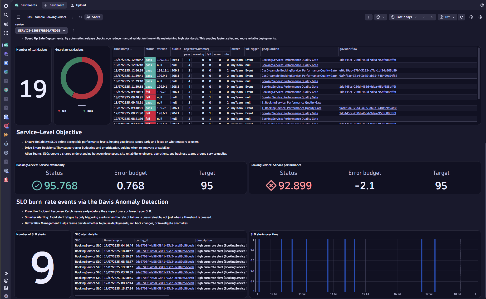

# Service monitoring and validation sample

This package provides a preconfigured Dynatrace dashboard for monitoring and validating the health and performacne of a selected service.
It contains a section of the 4 golden signals, results of release validations, service-level objectives and SLO fast-error budget burn rate alerts.
Additionally it provides a simple alert-notification workflows, to send an email in case of a high error budget burn rate alert.

## Features

- **Comprehensive Release Overview:** Visualize all releases across environments at a glance.
- **Detailed Filtering:** Drill down to specific releases or environments for more granular analysis.
- **Risk & Validation Tracking:** Quickly identify validation outcomes and potential risks (e.g., vulnerabilities) associated with each release.
- **Ready-to-Use Dashboards:** Get started quickly with pre-built dashboards and example configurations.

## Included Dyntrace resources
- **Dashboard** providing an overview of the health and performance status fo the selected service, including release validations, SLOs and past burn rate alerts.
- **Site-Reliability Guardian** validating the 4 golden signals
- **Release-validation workflow** to automate the Site-Reliability Guardian Valdations
- **Service-level objectives** to continuously observe the availability and performance of the selected service
- **Davis Anomaly Detector** to continuously watch the SLO's burn rate and raise an alert in case the condition is met
- **Alert notification workflow** to automatically send and email in case an SLO error budget burn rate alert is raised

## Prerequisites

To enable accurate release detection and ensure the dashboards work as intended:

- Monaco version `v2.24.0+`
- Platform token ([See our documentation](https://docs.dynatrace.com/docs/shortlink/configuration-as-code-create-platform-token)) covering the needed permission: Documents, Automation, SLO v2, Settings, email and additionally `app-engine:apps:run`

## Dashboard Previews

| Overview |
|----------|
|  |

## Getting Started

1. **Clone or Download** this repository.
2. **In the config.yaml** Add the service-entity-ID accordingly and add an valid email address as recipient of the burn rate alerting notification
2. **Import the Dashboard:** Follow the instructions in the dashboard JSON or documentation to import it into your Dynatrace environment.
3. **Set up your CI/CD tool:** Set up your CI/CD tool to send deployment for triggering the release validation [official documentation](https://docs.dynatrace.com/docs/shortlink/usecase-release-validation).
4. **Customize as Needed:** Adjust the dashboards or detection rules to fit your organization’s release and monitoring processes.

## Environment variables

You need a Dynatrace Platform environment and the following environment variables to try this out:

* `DT_ENV_ID`: YOUR-DT-ENVIRONMENT-ID
* `DT_ENV_URL`: https://<YOUR-DT-ENVIRONMENT-ID>.apps.dynatrace.com
* `PLATFORM_TOKEN`: *Returned when creating the platform token* (see:[docs](https://docs.dynatrace.com/docs/shortlink/configuration-as-code-create-platform-token))

## Documentation

- [Dynatrace Release Validation Docs](https://docs.dynatrace.com/docs/shortlink/usecase-release-validation)
- [Service-level objectives Docs](https://docs.dynatrace.com/docs/shortlink/slo-overview)
- [Site-Reliability Guardian Docs](https://docs.dynatrace.com/docs/shortlink/slo-overview)
- [Automated release validation tutorial](https://docs.dynatrace.com/docs/shortlink/tutorial-release-validation-automated)
- [Service-level objectives Docs](https://docs.dynatrace.com/docs/shortlink/slo-overview)
- [Monaco CLI Docs](https://docs.dynatrace.com/docs/shortlink/configuration-as-code-monaco)
- [Pipeline Observability](https://docs.dynatrace.com/docs/shortlink/pipeline-observability)

## Feedback & Contributions

Contributions and feedback are welcome! Please open issues or pull requests in this repository or reach out via Dynatrace Community.
