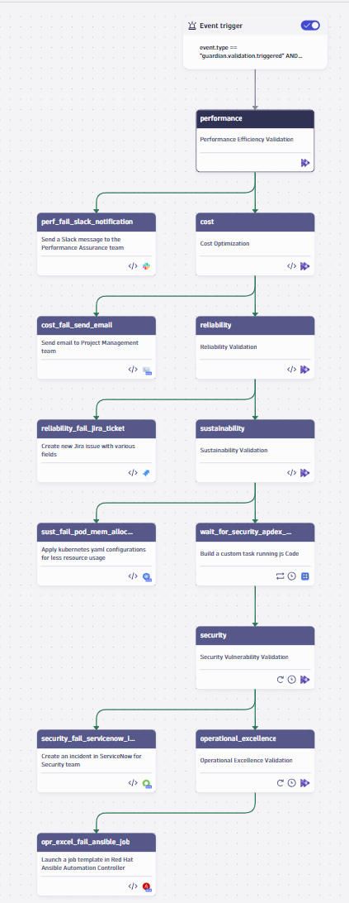

# Well-Architected Framework - Cloud Compliance Validation

> **Automated AWS Well-Architected Framework validation using Site Reliability Guardian and Dynatrace Workflows**

This sample demonstrates how to implement automated cloud compliance validation using the AWS Well-Architected Framework's six pillars. It provides comprehensive monitoring and validation of cloud infrastructure against reliability, security, performance, cost optimization, operational excellence, and sustainability best practices with automated compliance reporting.

 

## 🎯 What You'll Get

### 🏗️ **Six Pillars Validation**
- **Reliability**: Infrastructure resilience and fault tolerance monitoring
- **Security**: Security posture and compliance validation
- **Performance**: Performance optimization and efficiency monitoring
- **Cost Optimization**: Resource utilization and cost management
- **Operational Excellence**: Operational processes and automation
- **Sustainability**: Environmental impact and resource efficiency

### 🔒 **Compliance Automation**
- **Automated compliance checks** against AWS WAF standards
- **Real-time validation** of cloud infrastructure
- **Compliance reporting** for audit and governance
- **Regulatory alignment** with industry standards

### 📊 **Business Impact**
- **Ensure cloud compliance** with automated validation
- **Reduce compliance risks** through continuous monitoring
- **Streamline audit processes** with automated reporting
- **Maintain best practices** across all cloud resources

## 🚀 Quick Start

### Prerequisites
- AWS environment with CloudWatch integration
- Dynatrace environment with Site Reliability Guardian
- Dynatrace Workflows access
- API tokens with appropriate permissions

### Deploy Compliance Monitoring
```bash
# Clone and navigate to the sample
cd well_architected_framework_validation

# Deploy the compliance validation configuration
monaco deploy manifest.yaml
```

## 📋 Configuration Overview

### Guardian Configuration
The sample includes comprehensive Site Reliability Guardian configurations for each WAF pillar:

- **Reliability Guardian**: Monitors infrastructure resilience and fault tolerance
- **Security Guardian**: Validates security posture and compliance
- **Performance Guardian**: Tracks performance optimization metrics
- **Cost Guardian**: Monitors resource utilization and cost efficiency
- **Operational Excellence Guardian**: Validates operational processes
- **Sustainability Guardian**: Tracks environmental impact metrics

### Workflow Integration
Automated workflows that:

1. **Monitor cloud infrastructure** across all six pillars
2. **Evaluate compliance** against WAF best practices
3. **Generate compliance reports** for governance teams
4. **Send alerts** for non-compliant resources
5. **Track improvement trends** over time

## 🔧 Customization Options

### Compliance Thresholds
Adjust the Guardian rules to match your compliance requirements:

```yaml
# Example compliance thresholds
reliability:
  availability: 99.9%
  fault_tolerance: 99.5%
  disaster_recovery: enabled

security:
  encryption: enabled
  access_control: enforced
  compliance_standards: met

cost_optimization:
  resource_utilization: 70%
  cost_efficiency: optimized
  budget_compliance: within_limits
```

### Integration Customization
- **AWS CloudWatch**: Enhanced metrics and logging integration
- **Compliance tools**: Integration with existing compliance platforms
- **Reporting systems**: Custom compliance reporting and dashboards
- **Alert channels**: Configure notification channels for compliance issues

## 📈 Success Metrics

### Compliance KPIs
- **Compliance Score**: Target 95%+ across all six pillars
- **Violation Reduction**: 50-70% reduction in compliance violations
- **Audit Efficiency**: 80% reduction in manual audit time
- **Risk Mitigation**: Automated detection of compliance gaps

### Business Value
- **Regulatory Compliance**: Meet industry and government requirements
- **Risk Reduction**: Automated detection of compliance violations
- **Cost Savings**: Reduced manual audit and compliance costs
- **Operational Excellence**: Maintain cloud best practices automatically

## 🛠️ Advanced Features

### Multi-Account Support
- **Development**: Automated testing and validation
- **Staging**: Pre-production compliance checks
- **Production**: Final compliance validation with reporting

### Custom Compliance Rules
- **Industry Standards**: HIPAA, SOC2, PCI-DSS compliance
- **Internal Policies**: Custom organizational compliance requirements
- **Regional Requirements**: Location-specific compliance needs
- **Security Frameworks**: NIST, ISO 27001 alignment

### Automated Remediation
- **Auto-fix**: For simple compliance violations
- **Manual review**: For complex compliance issues
- **Escalation**: For critical compliance violations
- **Documentation**: Automated compliance documentation

## 🔍 Troubleshooting

### Common Issues
1. **Guardian not triggering**: Check AWS integration and API permissions
2. **Compliance violations**: Review thresholds and adjust based on requirements
3. **Reporting issues**: Verify data collection and reporting configuration
4. **Integration failures**: Check AWS CloudWatch and Dynatrace connectivity

### Debug Steps
1. **Check Guardian logs** in Dynatrace Workflows
2. **Verify AWS metrics** are being collected properly
3. **Review compliance rules** and threshold settings
4. **Test reporting** with sample data

## 📚 Related Examples

- **[Site Reliability Guardian](https://github.com/Dynatrace/dynatrace-configuration-as-code-samples/tree/main/site_reliability_guardian_sample)**: Quality gates and deployment validation
- **[VM Right-Sizing](https://github.com/Dynatrace/dynatrace-configuration-as-code-samples/tree/main/VM-RIght-Sizing)**: Cost optimization and resource management
- **[Pipeline Observability](https://github.com/Dynatrace/dynatrace-configuration-as-code-samples/tree/main/github_pipeline_observability)**: CI/CD compliance monitoring

## 🤝 Community Support

- **Questions?** [Open an issue](https://github.com/Dynatrace/dynatrace-configuration-as-code-samples/issues)
- **Improvements?** [Contribute](https://github.com/Dynatrace/dynatrace-configuration-as-code-samples/pulls)
- **Success Stories?** [Share your experience](https://github.com/Dynatrace/dynatrace-configuration-as-code-samples/issues/new?template=success-story.md)

---

**Ready to automate cloud compliance and ensure AWS best practices?** Deploy this compliance validation solution and maintain regulatory compliance with automated monitoring and reporting.
