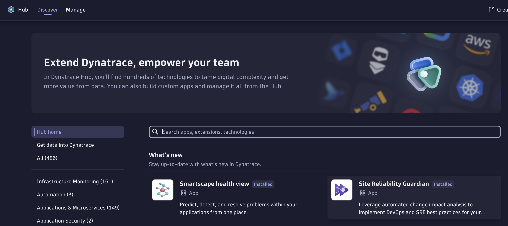
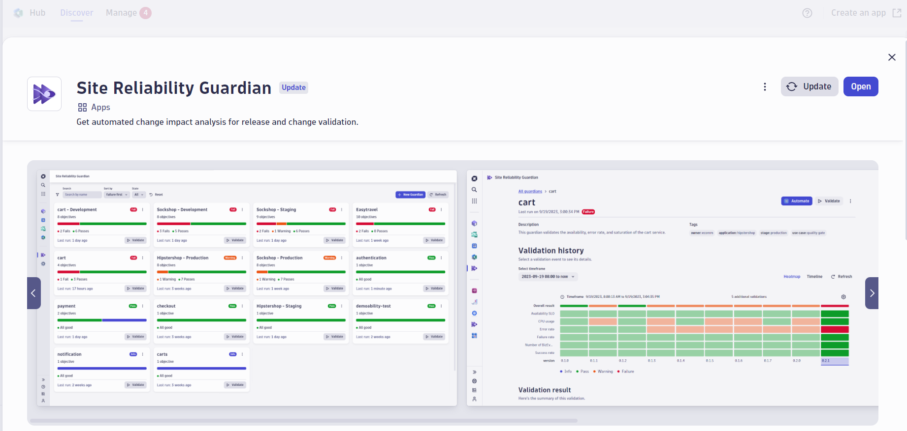
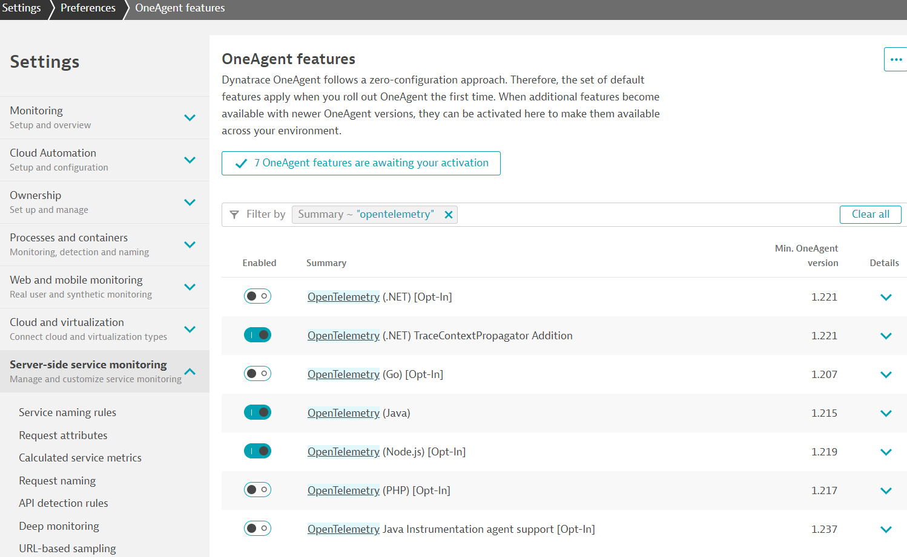

# Well-Architected Framework Six Pillars Workflow and Site Reliability Guardian Template

## Enabling your Dynatrace Environment:

First of all, install Site Reliability Guardian app from the Dynatrace Hub or upgrade it with the latest release if exists.
<details>
  <summary><strong>Install the Site Reliability Guardian</strong></summary>
  
  Search in the Dynatrace Hub for the Site Reliability Guardian and install it in your Dynatrace Environment.


</details>

<details>
  <summary><strong>Upgrade the Site Reliability Guardian</strong></summary>
   
  Search in the Dynatrace Hub for the Site Reliability Guardian and install it in your Dynatrace Environment.


</details>


### Performance Efficiency
- Enable OpenTelemetry span data for the technology you use for your deployed application
  For example, if your application is based on Node.js, enable it accordingly
  
  

### Security
- Enable Appsec

### Reliability    
- Enable Logs and Timeseries OOM_Kills

### Operational Excellence
- Enable RUM and Synthetic Monitoring

### Cost Optimization
- Enable Logs and Timeseries

### Sustainability
- Install Carbon-App and enable Timeseries


## How to Apply Workflow and SRG Configurations:
1. [Install monaco](https://www.dynatrace.com/support/help/manage/configuration-as-code/monaco/installation) 
   > Note: Verified Monaco Version is v2.6.0
2. Download the entire folder.  You can execute "git clone" command or directly download the artifacts from this repository
   ``` bash
   git clone --depth 1 --no-checkout https://github.com/eemrdog/dynatrace-configuration-as-code-samples.git
   cd dynatrace-configuration-as-code-samples
   git sparse-checkout set well_architected_framework_validation
   git checkout
   cd well_architected_framework_validation 
   ```
4. Open a terminal and navigate to the folder you downloaded in the previous step.
5. Export the below environment variables into your system with the certain values

   ``` bash
   # DT platform secrets
   export DT_TENANT_URL="<Dynatrace Tenant URL>" # e.g. https://xxxxx.dynatrace.com
   export DYNATRACE_URL_GEN3="<Dynatrace Platform Tenant URL>" # e.g. https://xxxxxx.apps.dynatrace.com
   export DT_API_TOKEN="<Dynatrace API Token>" # e.g. dt0xyz.XXXXXXXX.YYYYYYY
   export DYNATRACE_CLIENT_ID="<Dynatrace oAuth Client ID>" # e.g. dt0s02.XXXXYYY
   export DYNATRACE_SECRET="<Dynatrace oAuth Client Secret>" # e.g. dt0s02.XXXXYYY.SSSDDDD...
   export DYNATRACE_SSO_URL="<Dynatrace oAuth SSO Endpoint>" # e.g. https://sso-xxx.dynatrace.com/sso/oauth2/token
   
   # demo application params
   export USE_CASE="sixpillars"
   export RELEASE_PRODUCT="<Your Application Name>" # e.g. my-application
   export RELEASE_STAGE="<Your Application Stage in your deployment pipeline>"  # e.g. staging, dev, production
   export DOMAIN_URL="<Ingress domain for your application>" # e.g. http://easy-trade.internal.cloudapp.net, 34.79.202.168.nip.io
   ```

   Verify if these environment variables are set correctly. For example:
   ``` bash
   echo $DT_TENANT_URL
   echo $DOMAIN_URL
   echo $RELEASE_PRODUCT
   ```
6. Run the below command to generate a specific SRG configurations for your application that has been set in RELEASE_PRODUCT environment variable.

    ``` bash
    sh update-srg-id.sh
    ```
   
7. Run the below command to apply the workflow and SRG configurations along with the synthetic location configurations

   First, run with '--dry-run' option to validate the template monaco configurations with the given environment variables.
    ``` bash
    monaco deploy manifest.yaml --dry-run
    ```
    If the above dry-run is successful, continue with the actual deployment
    ``` bash
    monaco deploy manifest.yaml
    ```
8. Validate Workflow, SRG and Synthetic Location configurations are applied successfully. You can do this by going to the Dynatrace UI and check the following:
      - Workflow configurations are applied successfully
      - SRG configurations are applied successfully
      - Synthetic Locations are created successfully
      - Synthetic Monitors are created successfully

9. Trigger the Workflow to apply the well-architected framework validations

    - Navigate to the workflow with the name "Demo AWS Six Pillars SRG Evaluation" and click on "Run".
    - Paste the below event sample to trigger the workflow
    - Update the parameters shown within '< >' with your system details

      For example:  "tag.stage": "staging", "tag.service": "myapplication", "timestamp": 1698404074225000000
      
     ``` bash
     {
       "event.id": "0cbab6a2-18b4-47d3-a27b-1ea95651cf9b",
       "event.kind": "BIZ_EVENT",
       "event.type": "guardian.validation.triggered",
       "event.provider": "cicd",
       "timestamp": <time data with timestamp format>,
       "tag.usecase": "sixpillars",
       "tag.stage": "<Your Application Stage>",
       "tag.service": "<Your Application Name>",
       "timeframe.to": "<2023-11-06T14:38:59.783Z>",
       "timeframe.from": "<2023-11-06T14:34:59.783Z>",
       "dt.system.bucket": "default_bizevents",
       "execution_context": {
         "id": "0cbab6a2-18b4-47d3-a27b-1ea95651cf9b",
         "buildId": "<1.0.0-12345>",
         "version": "<1.0.0>"
       }
     }
     ```
   - Click on 'Run' and observe the workflow executions

## How to scale the same workflow for multiple workloads:
Once you completed the workflow and SRG configurations in the previous section, now it is time to scale the same workflow with your other workloads to be validated. Follow the below steps to apply them quickly at scale.

1. Skip the first 3 steps of the previous section and override only the below environment variables in addition to the existing command lines in the Step 4.
   
``` bash
export RELEASE_PRODUCT="<Your Application Name>" # e.g. my-application-2
export RELEASE_STAGE="<Your Application Stage in your deployment pipeline>"  # e.g. staging, dev, production
export DOMAIN_URL="<Ingress domain for your application>" # e.g. http://my-application-2.cloudapp.net
```

2. Continue with the remaining steps until Step 8 and update your Application name and stage information to generate a test trigger event accordingly.

## Integrate with a CICD Pipeline:

TODO : Show how the generic workflow looks like with Build, Test, Deploy stages. Explain how to add DT config and SRG evaluation jobs in the pipeline and where to add them.

> Note: Below steps are designed to be generic for different types of CICD tools.

#### 1. Define the secrets in your CICD pipeline using their secrets definition capabilities.
   > Note: The secrets can be defined in different ways depending on the CICD tool you are using.

   ``` bash
   # DT platform secrets
   DT_TENANT_URL=<Dynatrace Tenant URL> # e.g. https://xxxxx.dynatrace.com
   DYNATRACE_URL_GEN3=<Dynatrace Platform Tenant URL> # e.g. https://xxxxxx.apps.dynatrace.com
   DT_API_TOKEN=<Dynatrace API Token> # e.g. dt0xyz.XXXXXXXX.YYYYYYY
   DYNATRACE_CLIENT_ID=<Dynatrace oAuth Client ID> # e.g. dt0s02.XXXXYYY
   DYNATRACE_SECRET=<Dynatrace oAuth Client Secret> # e.g. dt0s02.XXXXYYY.SSSDDDD...
   DYNATRACE_SSO_URL=<Dynatrace oAuth SSO Endpoint> # e.g. https://sso-xxx.dynatrace.com/sso/oauth2/token
   ```
     
#### 2. Add the Dynatrace Workflow and Site Reliability Guardian creations job via Dynatrace Configuration as Code (Monaco)

   ##### 2.1 Define a job runner that will use the Docker image below.

   ```
   dynatrace/dynatrace-configuration-as-code:v2.6.0
   ```
     > Note: The job runner can be defined in different ways depending on the CICD tool you are using. For example:
     
     > in GitLab, you can define a runner by registering a runner with the Docker executor during registration and specifying which container to run the jobs in.
     
     > in Jenkins, you can define a runner by creating a new node and specifying the Docker image to use as the job runner.
     
     > in CircleCI, you can define a runner by specifying the Docker image to use as the job runner in your configuration file.
     
     > in GitHub Actions, you can define a runner by specifying the Docker image to use as the job runner in your workflow file.

   ##### 2.2 Once you have defined your job runner, you can then define the below bash scripts.
    ``` bash
    git clone https://github.com/eemrdog/six-pillars-workflow-template
    export USE_CASE="sixpillars"
    export RELEASE_PRODUCT="<Your application name>" # e.g. my-application
    export RELEASE_STAGE="<Your application stage in your deployment pipeline>"  # e.g. staging, dev, production
    export DOMAIN_URL="<Ingress domain for your application>" # e.g. http://easy-trade.internal.cloudapp.net, 34.79.202.168.nip.io

    monaco deploy --dry-run
    monaco deploy
    ```
#### 3. Add the six pillars evaluation job in the pipeline

   ##### 3.1 Define a job runner that will use the Docker image below.
   ```
   dynatraceace/dt-automation-cli:latest
   ```

   ##### 3.2 Once you have defined your job runner, you can then execute the below bash scripts.
    ``` bash
    RELEASE_PRODUCT="<Your application name>" # e.g. my-application
    RELEASE_STAGE="<Your application stage in your deployment pipeline>"  # e.g. staging, dev, production
    eval_start=<test start time>   # e.g. test start time in this format: $(date -u +"%Y-%m-%dT%H:%M:%SZ")
    eval_end=<test end time> # e.g. test end time in this format: $(date -u +"%Y-%m-%dT%H:%M:%SZ")
    
    dta srg evaluate --service $RELEASE_PRODUCT --stage $RELEASE_STAGE --start-time=$eval_start --end-time=$eval_end
    ```

   #### A Gitlab pipeline example:
   > Note: Do not forget to define the secrets mentioned in Step 1 above
   
   ``` bash
   Create_SixPillars_Workflow:
     stage: Deploy SixPillars Workflow
     image: dynatrace/dynatrace-configuration-as-code:v2.6.0
     script:
       - git clone https://github.com/eemrdog/six-pillars-workflow-template
       - export USE_CASE="sixpillars"
       - export RELEASE_PRODUCT="<Your Application Name>"
       - export RELEASE_STAGE="<Your Application Stage in your CICD pipeline>" 
       - export DOMAIN_URL="<Ingress domain for your application>" 

       - monaco deploy --dry-run
       - monaco deploy

   Evaluate_with_Six_Pillars_WF:
     image: dynatraceace/dt-automation-cli:latest
     stage: Execute SixPillars Workflow
     script:
       - eval_start=$(cat srg.test.starttime)
       - eval_end=$(cat srg.test.endtime)
       - dta srg evaluate --service $STAGE_NAME --stage $RELEASE_PRODUCT --start-time=$eval_start --end-time=$eval_end
   ```
   
## Cleanup
Run the below command to delete the workflow and SRG configurations along with the synthetic location configurations.

 ``` bash
 monaco delete --file delete.yaml
 ```
