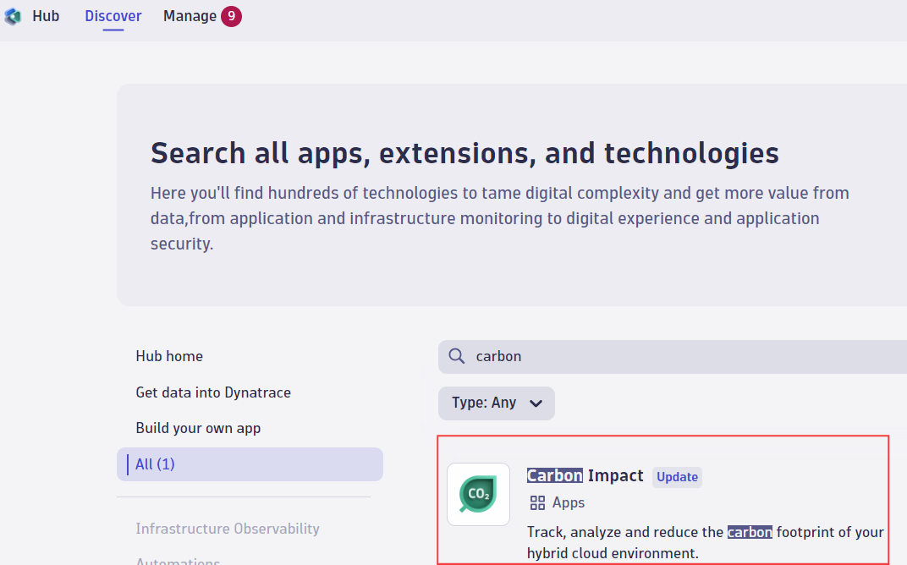

# Well-Architected Framework Six Pillars Workflow and Site Reliability Guardian Template

## Enabling your Dynatrace Environment:
### Site Reliability Guardian
First of all, install Site Reliability Guardian app from the Dynatrace Hub or upgrade it with the latest release if installed.
<details>
  <summary><strong>Install the Site Reliability Guardian</strong></summary>
  
  Search in the Dynatrace Hub for the Site Reliability Guardian and install it in your Dynatrace Environment.


</details>

<details>
  <summary><strong>Upgrade the Site Reliability Guardian</strong></summary>
   
  Search in the Dynatrace Hub for the Site Reliability Guardian and upgrade it to the release 1.6.4 if you have lower release in place.


</details>

### Well-Architected Pillars Prerequisities

#### Performance Efficiency
- Enable OpenTelemetry span data for the technology you use for your deployed application.
  For example, if your application is based on Node.js, enable it accordingly
  
  

#### Security
- Enable Application security on your Dynatrace environment by following the instructions in this [link](https://docs.dynatrace.com/docs/shortlink/start-security#enable-appsec).

#### Reliability    
- [Upgrade to Log Management and Analytics](https://docs.dynatrace.com/docs/observe-and-explore/logs/logs-upgrade/lma-upgrade) if you have classic log management

#### Operational Excellence
- Verify that Real User Monitoring (RUM) is enabled for operational excellence score calculation. You should navigate to `Settings -> Web and mobile monitoring -> Enablement and cost control` and turn on "Enable Real User Monitoring".

#### Cost Optimization
- No prerequisities needed.

#### Sustainability
- Install Carbon Impact App from the Dynatrace Hub or upgrade it with the latest release if installed.

  

## How to Apply Workflow and SRG Configurations:
1. [Install monaco](https://www.dynatrace.com/support/help/manage/configuration-as-code/monaco/installation) 
   > Note: Verified Monaco Version is v2.6.0
2. Download the entire folder.  You can execute "git clone" command or directly download the artifacts from this repository
   ``` bash
   git clone --depth 1 --no-checkout https://github.com/Dynatrace/dynatrace-configuration-as-code-samples.git
   cd dynatrace-configuration-as-code-samples
   git sparse-checkout set well_architected_framework_validation
   git checkout
   cd well_architected_framework_validation 
   ```
4. Open a terminal and navigate to the folder you downloaded in the previous step.
5. Export the below environment variables into your system with the certain values

   ``` bash
   # DT platform secrets
   export DT_TENANT_URL="<Dynatrace Tenant URL>" # e.g. https://xxxxx.dynatrace.com
   export DYNATRACE_URL_GEN3="<Dynatrace Platform Tenant URL>" # e.g. https://xxxxxx.apps.dynatrace.com
   export DT_API_TOKEN="<Dynatrace API Token>" # e.g. dt0xyz.XXXXXXXX.YYYYYYY
   export DYNATRACE_CLIENT_ID="<Dynatrace oAuth Client ID>" # e.g. dt0s02.XXXXYYY
   export DYNATRACE_SECRET="<Dynatrace oAuth Client Secret>" # e.g. dt0s02.XXXXYYY.SSSDDDD...
   export DYNATRACE_SSO_URL="<Dynatrace oAuth SSO Endpoint>" # e.g. https://sso-xxx.dynatrace.com/sso/oauth2/token
   
   # demo application params
   export USE_CASE="sixpillars"
   export RELEASE_PRODUCT="<Your Application Name>" # e.g. my-application
   export RELEASE_STAGE="<Your Application Stage in your deployment pipeline>"  # e.g. staging, dev, production
   export DOMAIN_URL="<Ingress domain for your application>" # e.g. http://easy-trade.internal.cloudapp.net, 34.79.202.168.nip.io
   export SLO_EVALUATION_WINDOW="-<time period>" # e.g. -5m,-1h,-2d 
   ```

    #### *Required API Token scopes for `DT_API_TOKEN` variable*
    Initial API token with scopes below is required to create a new API token with the required scopes for the use case.This token will be used by various roles to manage their own tokens.
   
    - slo.read
    - slo.write
    - CaptureRequestData
    - credentialVault.read
    - credentialVault.write
    - DataExport
    - DataPrivacy
    - ExternalSyntheticIntegration
    - ReadConfig
    - WriteConfig
    - events.ingest
    - settings.read
    - settings.write
    
    #### *Required oAuth scopes for `DYNATRACE_CLIENT_ID` variable*
    - automation:workflows:read (Read access to workflows)
    - automation:workflows:write (Write access to workflows)
    - automation:workflows:run (Execute permissions for workflows)
    - automation:rules:read (Read access to scheduling rules)
    - automation:rules:write (Write access to scheduling rules)
    - app-engine:apps:run (Access to Apps and its actions)
    - app-engine:apps:install (Install apps)
    - storage:logs:read
    - storage:logs:write
    - storage:events:read
    - storage:events:write
    - storage:metrics:read
    - storage:bizevents:read
    - storage:system:read
    - storage:buckets:read
    - storage:bucket-definitions:read
    - storage:bizevents:write
    - settings:objects:read
    - settings:objects:write
    - settings:schemas:read

6. Run the below command to generate a specific SRG configurations for your application that has been set in RELEASE_PRODUCT environment variable.

    ``` bash
    sh update-srg-id.sh
    ```
   
7. Run the below command to apply the workflow and SRG configurations along with the synthetic location configurations

   First, run with '--dry-run' option to validate the template monaco configurations with the given environment variables.
    ``` bash
    monaco deploy manifest.yaml --dry-run
    ```
    If the above dry-run is successful, continue with the actual deployment
    ``` bash
    monaco deploy manifest.yaml
    ```
8. Validate if Dynatrace configurations have been applied successfully. You can do this by going to the Dynatrace UI and check the following:
      - *Workflow and SRG configurations are applied successfully
      - Synthetic Monitors are created successfully
      - Application and detection rules set properly
      - SLO and Log ingestion rules applied correctly

   *To be able to view and run the workflow, make sure that below authorization settings are set as the following:
    
    

    - app-settings:objects:read
    - app-settings:objects:write
    - automation:rules:read 
    - automation:rules:write
    - automation:workflows:read
    - automation:workflows:run
    - automation:workflows:write
    - environment-api:entities:read
    - state:app-states:read
    - storage:buckets:read
    - storage:entities:read
    - storage:events:read
    - storage:events:write
    - storage:logs:read
    - storage:metrics:read
    - storage:spans:read
    - storage:system:read
    
9. Trigger the Workflow to apply the well-architected framework validations

    - Navigate to the workflow with the name starting with "Demo AWS Six Pillars SRG Evaluation" and click on "Run".
    - Paste the below event sample to trigger the workflow
    - Update the parameters shown within '< >' with your system details

      For example:  "tag.stage": "staging", "tag.service": "myapplication", "timestamp": 1698404074225000000
      
     ``` bash
     {
       "event.id": "0cbab6a2-18b4-47d3-a27b-1ea95651cf9b",
       "event.kind": "BIZ_EVENT",
       "event.type": "guardian.validation.triggered",
       "event.provider": "cicd",
       "timestamp": <time data with timestamp format>,
       "tag.usecase": "sixpillars",
       "tag.stage": "<Your Application Stage>",
       "tag.service": "<Your Application Name>",
       "timeframe.to": "<2023-11-06T14:38:59.783Z>",
       "timeframe.from": "<2023-11-06T14:34:59.783Z>",
       "dt.system.bucket": "default_bizevents",
       "execution_context": {
         "id": "0cbab6a2-18b4-47d3-a27b-1ea95651cf9b",
         "buildId": "<1.0.0-12345>",
         "version": "<1.0.0>"
       }
     }
     ```
   - Click on 'Run' and observe the workflow executions

## How to scale the same workflow for multiple workloads:
Once you completed the workflow and SRG configurations in the previous section, now it is time to scale the same workflow with your other workloads to be validated. Follow the below steps to apply them quickly at scale.

1. Skip the first 3 steps of the previous section and override only the below environment variables in addition to the existing command lines in the Step 4.
   
``` bash
export RELEASE_PRODUCT="<Your Application Name>" # e.g. my-application-2
export RELEASE_STAGE="<Your Application Stage in your deployment pipeline>"  # e.g. staging, dev, production
export DOMAIN_URL="<Ingress domain for your application>" # e.g. http://my-application-2.cloudapp.net
```

2. Continue with the remaining steps until Step 8 and update your Application name and stage information to generate a test trigger event accordingly.

## Integrate with a CICD Pipeline:

> Note: Below steps are designed to be generic for different types of CICD tools.

#### 1. Define the secrets in your CICD pipeline using their secrets definition capabilities.
   > Note: The secrets can be defined in different ways depending on the CICD tool you are using.

   ``` bash
   # DT platform secrets
   DT_TENANT_URL=<Dynatrace Tenant URL> # e.g. https://xxxxx.dynatrace.com
   DYNATRACE_URL_GEN3=<Dynatrace Platform Tenant URL> # e.g. https://xxxxxx.apps.dynatrace.com
   DT_API_TOKEN=<Dynatrace API Token> # e.g. dt0xyz.XXXXXXXX.YYYYYYY
   DYNATRACE_CLIENT_ID=<Dynatrace oAuth Client ID> # e.g. dt0s02.XXXXYYY
   DYNATRACE_SECRET=<Dynatrace oAuth Client Secret> # e.g. dt0s02.XXXXYYY.SSSDDDD...
   DYNATRACE_SSO_URL=<Dynatrace oAuth SSO Endpoint> # e.g. https://sso-xxx.dynatrace.com/sso/oauth2/token
   ```
#### 2. Define the application specific environment variables in your pipeline configuration file
   
   ``` bash
   export USE_CASE="sixpillars"
   export RELEASE_PRODUCT="<Your Application Name>" # e.g. my-application
   export RELEASE_STAGE="<Your Application Stage in your deployment pipeline>"  # e.g. staging, dev, production
   export DOMAIN_URL="<Ingress domain for your application>" # e.g. http://easy-trade.internal.cloudapp.net, 34.79.202.168.nip.io
   export SLO_EVALUATION_WINDOW="-<time period>" # e.g. -5m,-1h,-2d 
   ```

 #### 3. Clone the well_architected_framework_validation template from dynatrace-configuration-as-code-samples repository.
  
  Create a job/step in your pipeline using a job/step docker runner with a recommended image `alpine/git`
  Then copy the below code piece in your script section of the job.
  > Note:  After cloning the particular template folder, this script will adjust the parameters running the script `update-srg-id.sh`

  ``` bash
  git clone --depth 1 --no-checkout https://github.com/dynatrace/dynatrace-configuration-as-code-samples.git
  cd dynatrace-configuration-as-code-samples
  git sparse-checkout set well_architected_framework_validation
  git checkout
  cd well_architected_framework_validation 
  sh update-srg-id.sh
  ```

  Assign the below path as an artifact in your pipeline:
  
  ```
  dynatrace-configuration-as-code-samples/well_architected_framework_validation/
  ```
     
#### 4. Add the Dynatrace Workflow and Site Reliability Guardian creations job via Dynatrace Configuration as Code (Monaco)
   
   ##### 4.1 Define a job runner that will use the Docker image below.

   ```
   dynatrace/dynatrace-configuration-as-code:v2.6.0
   ```
     > Note: The job runner can be defined in different ways depending on the CICD tool you are using. For example:
     
     > in GitLab, you can define a runner by registering a runner with the Docker executor during registration and specifying which container to run the jobs in.
     
     > in Jenkins, you can define a runner by creating a new node and specifying the Docker image to use as the job runner.
     
     > in CircleCI, you can define a runner by specifying the Docker image to use as the job runner in your configuration file.
     
     > in GitHub Actions, you can define a runner by specifying the Docker image to use as the job runner in your workflow file.

   ##### 4.2 Once you have defined your job runner, you can then add the below script in your job.
    ``` bash
    export USE_CASE="sixpillars"
    export RELEASE_PRODUCT="<Your application name>" # e.g. my-application
    export RELEASE_STAGE="<Your application stage in your deployment pipeline>"  # e.g. staging, dev, production
    export DOMAIN_URL="<Ingress domain for your application>" # e.g. http://easy-trade.internal.cloudapp.net, 34.79.202.168.nip.io

    cd dynatrace-configuration-as-code-samples/well_architected_framework_validation
    monaco deploy manifest.yaml --dry-run
    monaco deploy manifest.yaml
    ```
#### 5. Add the six pillars evaluation job in the pipeline

   ##### 5.1 Define a job runner that will use the Docker image below.
   ```
   dynatraceace/dt-automation-cli:latest
   ```

   ##### 5.2 Once you have defined your job runner, you can then execute the below bash scripts.
    ``` bash
    RELEASE_PRODUCT="<Your application name>" # e.g. my-application
    RELEASE_STAGE="<Your application stage in your deployment pipeline>"  # e.g. staging, dev, production
    eval_start=<test start time>   # e.g. test start time in this format: $(date -u +"%Y-%m-%dT%H:%M:%SZ")
    eval_end=<test end time> # e.g. test end time in this format: $(date -u +"%Y-%m-%dT%H:%M:%SZ")
    
    dta srg evaluate --service $RELEASE_PRODUCT --stage $STAGE_NAME --release-version $RELEASE_VERSION --buildId $RELEASE_BUILD_VERSION --start-time=$eval_start --end-time=$eval_end --multiple-guardians
    ```

   #### A Gitlab pipeline example:
   > Note: Do not forget to define the secrets mentioned in Step 1 above
   
    ``` bash
    Clone the configurations:
      stage: Clone
      image: alpine/git
      script:
        # Clone the Six Pillars Workflow configurations
        - git clone --depth 1 --no-checkout https://github.com/Dynatrace/dynatrace-configuration-as-code-samples.git
        - cd dynatrace-configuration-as-code-samples
        - git sparse-checkout set well_architected_framework_validation
        - git checkout
        - cd well_architected_framework_validation 
        - sh update-srg-id.sh
      artifacts:
        paths:
          - dynatrace-configuration-as-code-samples/well_architected_framework_validation/
  
     Create_SixPillars_Workflow:
       stage: Deploy SixPillars Workflow
       image: dynatrace/dynatrace-configuration-as-code:v2.6.0
       script:
         - export USE_CASE="sixpillars"
         - export RELEASE_PRODUCT="<Your Application Name>"
         - export RELEASE_STAGE="<Your Application Stage in your CICD pipeline>" 
         - export DOMAIN_URL="<Ingress domain for your application>" 
         - export SLO_EVALUATION_WINDOW="-<time period>" # e.g. -5m,-1h,-2d 
         
         - cd dynatrace-configuration-as-code-samples/well_architected_framework_validation
         - monaco deploy --dry-run
         - monaco deploy
  
     Evaluate_with_Six_Pillars_WF:
       image: dynatraceace/dt-automation-cli:latest
       stage: Execute SixPillars Workflow
       script:
         - eval_start=$(cat srg.test.starttime)
         - eval_end=$(cat srg.test.endtime)
         - dta srg evaluate --service $RELEASE_PRODUCT --stage $STAGE_NAME --release-version $RELEASE_VERSION --buildId $RELEASE_BUILD_VERSION --start-time=$eval_start --end-time=$eval_end --multiple-guardians
     ```
   
## Cleanup
Run the below command to delete the workflow and SRG configurations along with the other Dynatrace configurations.

 ``` bash
 monaco delete --file delete.yaml
 ```
